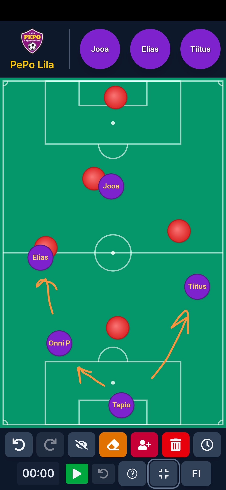

# PEPO Soccer App

A web application designed for soccer coaches and teams to manage game timing, track statistics, visualize player positions, and access relevant team resources during matches.

  

## Key Features

*   **Match Timer:**
    *   Start, pause, and reset game timer.
    *   Supports configurable period duration and number of periods (1 or 2).
    *   Large timer overlay view for clear visibility.

*   **Substitution Management:**
    *   Set substitution interval duration (in minutes).
    *   Visual alerts (warning/due) for upcoming substitution times.
    *   Record when substitutions are made.
    *   Track time since the last substitution.
    *   View completed interval durations in the timer overlay.

*   **Game Management:**
    *   Create new games with opponent name, date, and game type (season vs tournament)
    *   Save multiple games with custom naming
    *   Auto-save functionality when game setup is completed
    *   Load saved games to continue tracking or review
    *   Add notes during the game

*   **Game Statistics:**
    *   Log goals for the home team, including scorer and optional assister.
    *   Quickly record opponent goals.
    *   View a filterable and sortable player stats table (Goals, Assists, Points).
    *   Edit goal information (scorer, assister, time).
    *   Filter statistics by game type (season, tournament, all games).
    *   Award fair play cards to players.
    *   Review a time-sorted event log (Goals, Opponent Goals).
    *   Edit game information (opponent name, date, score).

*   **Data Export & Backup:**
    *   Export individual games as JSON or CSV.
    *   Export all games data for backup purposes.
    *   Human-readable CSV format compatible with Excel.
    *   Detailed statistics including player performance, goal logs, and game info.

*   **Roster Management:**
    *   Add, edit, and remove players.
    *   Assign jersey numbers.
    *   Add player notes.
    *   Select active players for each match.
    *   Mark players as goalies.

*   **Interactive Tactics Board:**
    *   Drag & Drop players from the bar to the field.
    *   Move players and opponent markers on the field.
    *   Toggle player name visibility.
    *   Freehand drawing tool with undo/redo capability.
    *   Clear field or drawings independently.

*   **Progressive Web App (PWA):**
    *   Install as a standalone app on mobile or desktop.
    *   Offline functionality.
    *   Responsive design for all screen sizes.

*   **Usability Features:**
    *   Internationalization (English/Finnish).
    *   State persistence using browser local storage.
    *   In-app hard reset option.
    *   Fullscreen mode.
    *   Touch-friendly controls.
    *   Integrated help guide.
    *   Dark theme.

## Tech Stack

*   **Framework:** [Next.js](https://nextjs.org/)
*   **Language:** [TypeScript](https://www.typescriptlang.org/)
*   **UI Library:** [React](https://reactjs.org/)
*   **Styling:** [Tailwind CSS](https://tailwindcss.com/)
*   **Internationalization:** [i18next](https://www.i18next.com/) and [react-i18next](https://react.i18next.com/)
*   **Storage:** Browser LocalStorage API
*   **Progressive Web App:** Service Workers & Web App Manifest

## Getting Started

1.  **Clone the repository:**
    ```bash
    git clone https://github.com/VillePajala/soccer-app.git 
    cd soccer-app
    ```

2.  **Install dependencies:**
    ```bash
    npm install
    # or yarn install / pnpm install
    ```

3.  **Run the development server:**
    ```bash
    npm run dev
    # or yarn dev / pnpm dev
    ```

4.  Open [http://localhost:3000](http://localhost:3000) with your browser.

## Usage Tips

### Auto-Saving Games
When you create a new game and complete the setup form with an opponent name, the app will automatically create a save file and begin auto-saving all changes. If you skip the setup, you'll need to manually save your game later.

### Game Types
You can categorize games as either "Season" or "Tournament" games, which allows you to filter statistics based on game type when viewing historical data.

### Player Management
Use the roster settings to manage your team's players. You can add new players, remove players, assign jersey numbers, and add notes about players.

### Offline Usage
The app functions as a Progressive Web App (PWA) and can be installed on your device for offline use. Look for the install prompt or use your browser's "Add to Home Screen" option.

## Resetting Application Data

If you need to completely reset the application and clear all stored data (players, positions, stats, etc.), you can use the "Hard Reset App" option found at the bottom of the Settings menu (cog icon).

---

*Feel free to contribute or report issues!*
