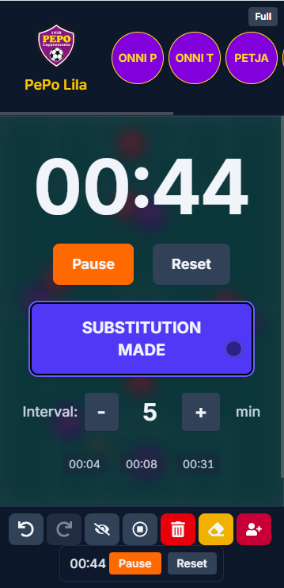

# Soccer Tactics Board

A touch-friendly web app for visualizing soccer tactics, managing players, and drawing plays. Built with React/Next.js.


## Features

*   **Interactive Tactics Board:** Visualize formations on a realistic soccer field background.
*   **Drag & Drop Players:**
    *   Drag players from the top bar onto the field.
    *   Move players already on the field.
    *   Double-tap (or double-click) a player on the field to remove them.
*   **Player Management:**
    *   Available players listed in the top bar.
    *   Double-tap (or double-click) a player in the bar to edit their name.
    *   Tap a player in the bar to select them for placement; tap again to deselect.
    *   Differentiates between tap/drag start and horizontal scrolling in the player bar.
*   **Opponent Markers:** Add simple opponent markers to the field via the control bar and drag them around. Double-tap/click to remove.
*   **Drawing Tool:** Draw freehand lines on the field to illustrate runs, passes, or zones.
*   **Team Name Editing:** Double-tap (or double-click) the team name in the top bar to edit it.
*   **Timer & Substitution Management:**
    *   Start, pause, and reset a match timer.
    *   Configure substitution interval alerts (warning/due).
    *   Record substitutions made.
    *   View player play time based on timer and substitutions in an overlay.
    *   Optional large timer overlay display.
    
*   **Touch-Friendly Controls:** Designed with touch devices in mind, including double-tap actions and scroll detection.
*   **Undo/Redo:** Step back and forth through your tactical changes.
*   **Control Bar:** Access features like adding opponents, clearing drawings, toggling player names, resetting the field, and timer controls.
*   **State Persistence:** Your setup (players, drawings, team name, timer state) is automatically saved to your browser's local storage.
*   **Fullscreen Mode:** Toggle fullscreen for an immersive view.

## Tech Stack

*   **Framework:** [Next.js](https://nextjs.org/)
*   **Language:** [TypeScript](https://www.typescriptlang.org/)
*   **UI Library:** [React](https://reactjs.org/)
*   **Styling:** [Tailwind CSS](https://tailwindcss.com/)

## Getting Started

1.  **Clone the repository:**
    ```bash
    git clone https://github.com/VIllePajala/soccer-app.git 
    cd soccer-app
    ```

2.  **Install dependencies:**
    ```bash
    npm install
    # or
    # yarn install
    # or
    # pnpm install
    ```

3.  **Run the development server:**
    ```bash
    npm run dev
    # or
    # yarn dev
    # or
    # pnpm dev
    ```

4.  Open [http://localhost:3000](http://localhost:3000) with your browser to see the result.

---

*Feel free to contribute or report issues!*
